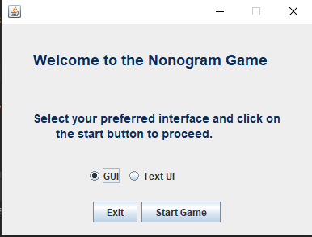
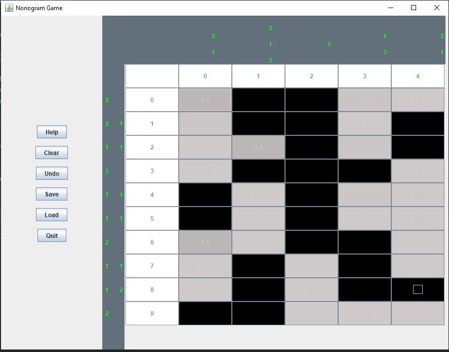

# Nonogram Puzzle - Olawale

## Problem Statement:
The tasks you are to carry out are as follows:
To complete the implementation of the text-based user interface to include the (as yet unimplemented) clear 
(i.e., reset the Nonogram game), undo (a single user move, then a further move if called again, and so on), 
save (the state of the game to a file) and load (the state of the game from file) methods. 
You should only need to make changes to the main user interface class (NonogramUI) and the helper class Assign to achieve this.

To design and implement a graphical user interface (GUI) for the Nonogram model code that allows the user to make moves, 
undo user moves, clear (reset) the game, save to, and load from file.

## How it was implemented:
To complete the text based UI, three methods were added:
1. saveToFile()
2. loadFromFile() and 
3. undoRecentMove()

See Nonogram.java for the definition and documentation of these methods

The Graphical User Interface of the Nonogram Game comprises ;
1. GameIntro.java
2. GameButtons.java.java
3. CellsPanel.java
4. MainGUI.java

### GameIntro.java
This is the entry point to the game. This class creates the view that enables users
to select the kind of user interface they want the game in. 

### GameButtons.java:
This panel contains the help, clear, undo, save, quit and load buttons

### CellsPanel.java
The gridPanel contains the cells for the nonogram puzzle.
NB: each cell in the nongram game is actually a JButton. 

### GUI.java
This is the main frame on which all the UI components are added to complete the Nonogram Game UI.

The following methods were added to the GUI.java to complete the functionality of the nongram game
1. formatRowHint()
2. transformStringToVertical()
3. resetGame()
4. getButtonColor()
5. createUI()

See GUI.java for the documentation of these methods

___
### How to run the Puzzle:
___
Open the project in your favourite IDE and run the GameIntro.java file located in the 
src/nonogram package.

This will give you the option to select either the Graphical version or the text based version of 
the puzzle. 

**NB: Whenever a row or column is solved, the row or column hint will change color to Green.
You Should see all the column and row hints light up green upon successful completion of the puzzle as
can be seen below;** 

 
 

#### All The Best !!!
